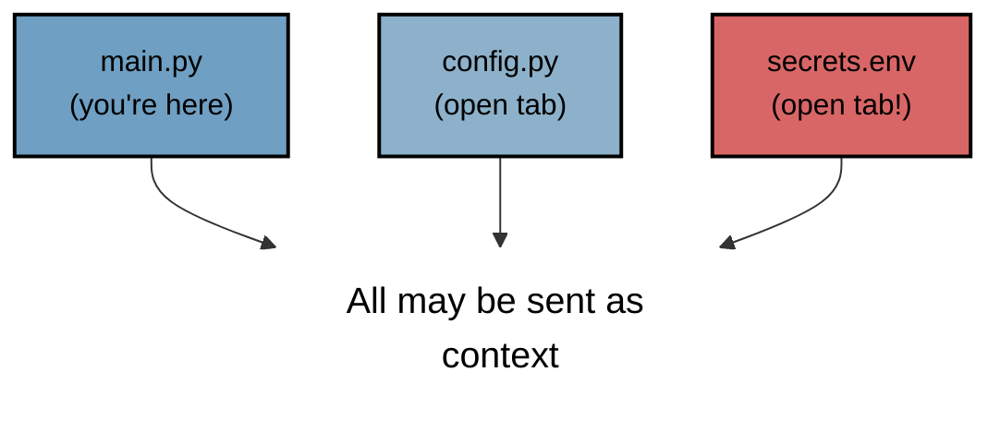

::::::::::::::::::::::::::::::::: questions

- How do IDE-integrated AI assistants like GitHub Copilot work?
- What information is sent to remote servers when I use these tools?
- How can I configure these tools to balance productivity and privacy?
- How do I move from vibe coding to research orchestration?
- How can I use one AI to catch the errors of another?

:::::::::::::::::::::::::::::::::::::::::::

:::::::::::::::::::::::::::::::: objectives

- Compare the functioning, scope, and risks of the IDE integrated LLM in relation to the chat-based LLM.
- Choose a generative AI tool for writing code according to the task.
- Write a snippet of code using generative AI directly in the IDE.
- Validate AI generated scripts using a critical framework (that the AI is doing the right thing)
- Understand how IDE-integrated AI assistants process your code
- Learn to configure GitHub Copilot and similar tools
- Recognize the reduced transparency compared to chat-based approaches
- Develop habits for reviewing inline suggestions critically
- Shift from a writer to an auditor mindset using the approval gate.
- Use a four-layer validation stack with explicit requirement constraints.
- Use multi-model verification to peer-review research code.

:::::::::::::::::::::::::::::::::::::::::::


## Introduction

Helen has cleaned the inherited script and now wants to extend it with a sensitive survey dataset. She needs to merge country-level environmental and economic concern data with CO2 and GDP per capita, and plot two new scatter plots. She shifts from chat-based prompting to an IDE-integrated assistant, but to do this safely, she decides to do this only after sandboxing the project and restrict what the tool can see.

The new file, `survey_participants.csv`, contains information about 100 researchers with direct identifiers
(names and emails), demographics (age, gender, nationality, institution, department, income band),
and survey responses on AI tools, data sharing, open science, and concern levels.

## The IDE integration scenario

In this scenario, AI assistance is integrated directly into your development
environment. As you type, the AI suggests completions, entire functions, or
even multi-line code blocks.

Generative AI has the potential to transform how researchers work with code,
and with the integration of such capability within common IDEs, such as Visual Studio Code,
provide the coding researcher with powerful tools to modify, expand and otherwise work with code.
But this potential needs to be tempered with critical thinking and a healthy degree of skepticism.

{alt="Photo of Python code within an IDE"}

### Common tasks and features

AI coding assistants in IDEs (such as GitHub Copilot) provide a bewildering array of support for various tasks.
For code editing, these include:

- **Code completion and generation** - suggests and generates code snippets based on context, reducing time spent on boilerplate and repetitive code
- **Function and method suggestions** - proposes complete function implementations based on function signatures and docstrings
- **Refactoring support** - suggestions for improving code structure and readability

At a higher level, they can also provide:

- **Code explanation** - explains how existing code works, helping researchers understand unfamiliar code or learn new programming patterns
- **Debugging assistance** - identifies potential bugs and suggests fixes for problematic code
- **Documentation generation** - automatically generates comments, docstrings, and README content
- **Test generation** - creates unit tests for existing code to improve code reliability
- **Language/framework translation** - converts code between programming languages and frameworks

Such tools can also assist with writing new code,
helping to structure projects and write new functionality by generating code based on high-level descriptions, function signatures, and requirements.
These initial implementations are then reviewed and refined by developers.

### Benefits and risks

AI coding assistants can accelerate development by reducing time spent on routine coding tasks, allowing researchers to focus on domain-specific problems.
For those new to a programming language, these tools help lower the learning curve and enable faster productivity.
The suggestions and examples provided by AI assistants may also encourage better coding practices and improve overall code quality, including documentation.

However, they also introduce significant risks:

- **Correctness and validation** - generative systems optimize for likelihood, not correctness. AI-generated code can sound confident but be incomplete, incorrect, or insecure. Researchers remain fully responsible for validating outputs.
- **Limited explanation** - unlike a standalone AI like ChatGPT, IDE-integrated AI often provides suggestions without detailed reasoning. This can reduce researchers' understanding of AI-generated code.
- **Potential over-reliance** - it can be very tempting to accept AI code suggestions that appear to work without fully understanding them.
- **Privacy and security risks** - the AI may send code snippets to cloud services for processing. Sensitive data or unpublished research could be exposed if this is not carefully managed.
- **Context and edge cases** - AI assistants may miss domain-specific requirements, edge cases, or research-specific constraints that are critical for correctness.
- **Code quality** - generated code may work but be inefficient, poorly structured, or violate best practices, degrading long-term maintainability.


<!-- ```{figure} img/vscode_githubcopilot.png
:alt: VS-code and GitHub copilot
:width: 100%

Visual Studio code with GitHub copilot plugin. You can see the chat and a suggestion based on a comment that is waiting to be accepted. The AI system runs in a remote end-point most likely in USA GitHub (Microsoft) servers.
``` -->

### How this differs from chat-based coding

| Aspect | Chat-based (Scenario I) | IDE-integrated (Scenario II) |
| --- | --- | --- |
| **Data flow** | You explicitly paste code | Context sent automatically |
| **Visibility** | You see exactly what you share | Less clear what's transmitted |
| **Execution** | Manual copy/paste | Still manual, but faster |
| **Context** | Limited to what you provide | May include entire project |

## What information leaves your machine?

When you use IDE-integrated tools, data transmission happens automatically
and continuously. Understanding what's sent is crucial.

### Typically transmitted data

| Data Type | Purpose | Privacy Concern |
| ----------- | --------- | ----------------- |
| Current file content | Generate relevant suggestions | May contain sensitive code |
| Open file tabs | Broader context | More exposure |
| File paths | Understand project structure | Reveals project organization |
| Cursor position | Know what to complete | Minimal concern |
| Recent edits | Understand your intent | Sent frequently |

### What may be transmitted (tool-dependent)

- Other files in your workspace
- Git history
- Comments and docstrings
- Import statements (revealing your dependencies)

:::{callout} Read your tool's documentation
Each tool has different data collection policies. For example:
- GitHub Copilot transmits code context to GitHub/Microsoft servers
- Some tools offer "local only" models (e.g., Tabnine)
- Enterprise tiers may offer data isolation guarantees
:::

## Setting up GitHub Copilot

<!-- :::callout
To-Do: The content of this session might not be fully up to date.
::: -->

GitHub Copilot is currently the most widely-used IDE-integrated assistant.
Here's how to set it up with privacy and control in mind.

GitHub Copilot integrates directly into Visual Studio Code as an extension installable from within the IDE,
providing access to:

- **On-request explanations** - allowing you to obtain responses to questions in a chat interface
- **Real-time assistance as you continue to develop your code** - where Copilot continuously analyzes the code you write, as well as comments and surrounding context, to offer intelligent suggestions which require approval.
- **On-request direct code modification** - by requesting specific changes, your code is modified directly by Copilot (again, requiring specific approval before it integrates the suggested changes)

All of this is integrated into the VSCode editor, so you do not need to leave your development environment.

### The lifecycle of a Copilot prompt

So how does Copilot integrate with VSCode, and how does it handle data?
Let's look at how it creates a code suggestion as an example:

<!-- [Placeholder: Add the lifecycle figure from Southampton (fig/copilot-prompt-lifecycle.png).] -->

At a high level, the following steps are followed:

Within the Copilot-enabled IDE:

1. Developer enters text into code editor, such as VSCode, gathering context from a number of sources (code before and after cursor, file name and type, other open editor tabs)
2. The prompt is constructed from the amassed context and sent to the Copilot proxy

Within the Copilot proxy (within the "Cloud"):

3. Filters the requests, terminating those involving toxic language, unrelated code requests, and perceived hacking attempts.
4. The prompt is sent to the GitHub Copilot LLM

The Copilot LLM (also in the "Cloud"):

5. Receives the request and formulates a code suggestion which is sent back to the proxy

Back within the Copilot proxy:

6. Receives the response, and tests code suggestions for code vulnerabilities, truncating responses that contain unique identifiers (such as email addresses, GitHub URLs, IP addresses, etc.), and filters out those matching known public code. The processed response is fed back to the Copilot client within the IDE

Back within the Copilot-enabled IDE:

7. The Copilot extension receives the code suggestion which is presented to the user to accept or reject

GitHub provides further detailed information about [how GitHub Copilot handles data](https://resources.github.com/learn/pathways/copilot/essentials/how-github-copilot-handles-data/).

### Installation in VS Code

1. Install the "GitHub Copilot" extension from the marketplace
2. Sign in with your GitHub account
3. If you have an educational email, you may qualify for free access

### Key configuration settings

Open VS Code settings (Ctrl+, or Cmd+,) and search for "Copilot":

```json
{
    // Disable automatic suggestions (require manual trigger)
    "github.copilot.enable": {
        "*": true,
        "markdown": false,  // Disable for documentation
        "plaintext": false  // Disable for plain text files
    },

    // Require explicit trigger instead of automatic suggestions
    "editor.inlineSuggest.enabled": true,

    // Control which files Copilot can access
    "github.copilot.advanced": {
        "indentationMode": {
            "python": true,
            "javascript": true
        }
    }
}
```

### Disabling AI assistend coding for sensitive files

Ideally, there would be an equivalent of `.gitignore` so that certain files are never sent to remote end-point (e.g. secrets, credentials, sensitive data). Some tools support this type of control, but with GitHub copilot ["Content exclusion is available only with a GitHub Copilot Business or a GitHub Copilot Enterprise subscriptions."](https://learn.microsoft.com/en-us/visualstudio/ide/visual-studio-github-copilot-admin?view=vs-2022).

For a recent survey of other tools and their *ignore* settings, [see this link](https://github.com/yjcho9317/aiignore-cli/blob/main/docs/test-report.md).

An alternative is to run VScode inside a container so that only certain folders of the file system are visible, and secrets can be separated.

## The hidden context problem

A key difference from chat-based AI is that you don't explicitly control
what context the model receives. This has implications:

### Example: Unintended context sharing



**The issue**: You might have a secrets file open in another tab, and parts
of it could be included in the context sent to the AI server.

### Mitigation strategies

1. **Close sensitive tabs** when using AI completion
2. **Use sandboxing / containerization** to exclude sensitive files
3. **Consider workspace separation** - keep sensitive projects in different VS Code windows
4. **Review your open tabs** before intensive AI-assisted sessions
5. **Compression of the context** some tools (e.g. Claude code) or some extensions can compress what goes to the context window so that not all the files need to be sent to remote for synthesising new code.

## Sandboxing options for sensitive data

When sensitive data is involved, decide upfront how to isolate files and control access. The goal is to limit what an IDE assistant can read while keeping a workable development flow.

### Option 1: Container-based sandbox (recommended)

Run VS Code in a container and mount only the project folder you want the assistant to access. Keep sensitive files in a separate directory that is not mounted.

[Placeholder: Add Docker-based setup steps and a minimal `devcontainer` or run command.]

### Option 2: Local isolation without Docker

Create a dedicated project folder that contains only the code and non-sensitive datasets. Keep the sensitive survey data in a separate location and copy in only the columns needed for analysis.

[Placeholder: Add OS-specific steps for creating a clean workspace and copying inputs.]

### Option 3: No sandbox (risky)

If you cannot sandbox, document the risk and reduce exposure by closing tabs, limiting open files, and disabling AI assistance for sensitive folders where possible.

Check with your institution for the specific guidance and policy checks.

## Checklist before you start

Before you write a single line of code, make three explicit decisions:

- **Which programming language?**: Python (this workshop). The most popular language for data science; enormous library ecosystem; runs everywhere.
- **Where will the computation run?**: Your laptop, your organisation's cloud, or an external cloud service. See the next section.
- **Where does your data live?**: Local disk, institutional storage, or a public URL. This matters especially if the data is sensitive or personal.

The "where" question is more important than it first appears. It affects data confidentiality, ease of setup, and whether your workflow will still work in six months when a cloud service changes its terms.

<!-- (workshop-setup)= -->

## The geography of computing

Every time you run code, the computation happens *somewhere*. There are three broad categories:

[Placeholder: Insert the diagram from workshop-data-viz showing local, org cloud, and external cloud trade-offs.]

| Environment | Examples | Advantages | Considerations |
| --- | --- | --- | --- |
| **Local laptop** | Your own machine, Python installed | Data never leaves your hands; works offline; full control | Risk if device is lost/stolen; requires manual installation; limited RAM/CPU |
| **Organisation cloud** | Aalto JupyterHub (`jupyter.cs.aalto.fi`), CSC Noppe (`noppe.csc.fi`) | Institutional data protection; software pre-installed; no personal hardware risk | Depends on institution's uptime and quota; requires account |
| **External cloud** | Google Colab, Kaggle Notebooks | Zero installation; free tier available; easy to share | Unclear or unfavourable terms of service; data uploaded to third party; may not be suitable for sensitive data |

:::{warning}
If you are working with real research data -- especially personal data, clinical data, or anything covered by your institution's data management plan -- check with your data protection officer or IT security team before choosing an environment. External cloud services (including Google Colab and GenAI tools) are generally **not** suitable for sensitive or personal data.
:::

## Choosing a GenAI assistant

There are three categories of GenAI coding assistant, differing mainly in where the computation runs:

[Placeholder: Insert the diagram from workshop-data-viz showing local, org, and external GenAI options.]

| Option | Example | Notes |
|---|---|---|
| **Local (on your machine)** | [llama.cpp](https://github.com/ggerganov/llama.cpp) | Fully private; no data leaves your computer; requires a capable GPU or CPU; setup is non-trivial. See {doc}`appendix-local-llms`. |
| **Organisation's GenAI** | [ai.aalto.fi](https://ai.aalto.fi) (Aalto only) | Complies with institutional data policy; recommended for sensitive work |
| **External cloud** | ChatGPT, Gemini, Claude | Easy to access; generally free tier available; review the provider's privacy terms before use |

:::{warning}
Do **not** paste real personal data, clinical data, or any data covered by a confidentiality agreement into an external GenAI tool. The text you submit is typically used to improve the model or stored on the provider's servers.
:::

## The approval gate: verification over generation

In an agentic research workflow, your role is to audit and approve code rather than write it. The standard has shifted from vibe coding to spec-driven orchestration.

The approval gate is the point where you decide AI-generated code is robust enough for research production. It separates a working prototype from validated science.

:::::::::::::::::::::::::::::::::::::::::::::::::: callout

## The review-first standard
The bottleneck in research is no longer writing code; it is verifying it. A high-performance workflow follows this cycle:
Plan -> Agent Implementation -> Automated AI-Powered Testing -> Human Review.

::::::::::::::::::::::::::::::::::::::::::::::::::

## Measuring efficiency: rewrite time

Rewrite time is a metric to determine if an AI workflow is actually helping your research.

- **Definition:** The manual effort in minutes a researcher spends making AI-generated output production-ready.
- **Goal:** If you spend 20 minutes prompting but then 40 minutes fixing the code, your rewrite time is too high. 

::::::::::::::::::::::::::::::::::::::::::::::::::: challenge

## Challenge: calculate your rewrite time

Look back at a script you recently generated with an AI agent.
1. How many minutes did you spend fixing or refactoring the code to make it run?
2. If this took more than 10% of the total task time, what was the likely cause? 
    - Ambiguous specs? 
    - AI over-confidence? 
    - Lack of local context?

:::::::::::::::::::::::::::::::::::::::::::::::::::

## The four-layer validation stack

To minimize rewrite time and ensure research rigor, use a structured validation stack.

### Layer 1: Requirement constraints (No-Go Zones)
Before the AI writes code, define requirement constraints in your `AGENTS.md`. These are rules the AI is not allowed to break.

*Example:* "Do not change the column names in `raw_data.csv`" or "Use only base R for this visualization to ensure compatibility."

### Layer 2: Automated unit tests
Ask the agent to write tests before the implementation. Use a prompt pattern like: "First, write five Pytest cases that define the success of this data cleaning script. I will approve the tests before you write the logic."

### Layer 3: Metamorphic and invariant checks
Test the relationships in your data that should never change.
- **Invariants:** The total number of participants must remain 150 after merging.
- **Metamorphic checks:** If I change the order of the input rows, the final mean score should not change.

### Layer 4: Domain plausibility
This is where your research expertise is irreplaceable. AI does not know that a negative blood pressure reading is impossible.

---

## Multi-model verification

We use a challenger model to audit an implementation model rather than trusting a single AI.

::::::::::::::::::::::::::::::::::::::::::::::::::::: challenge

## Challenge: orchestrate a peer review

1. Use Model A (such as Claude Code or Cursor) to generate a data cleaning script.
2. Provide the code to Model B (such as Gemini CLI) with the following prompt:
   
   "Read this script. Act as a skeptical senior data scientist. Identify three potential edge cases where this script will fail, such as empty strings, NaN values, or encoding issues. Suggest specific assert statements to catch these."

3. Reflect: Did the challenger model find something the implementation model missed?

::::::::::::::::::::::::::::::::::::::::::::

:::::::::::::::::::::::::::::::::::::::::::: solution

## Why this works

Models have different blind spots. Forcing a second AI to act as an auditor helps bypass the tendency of the primary assistant to be over-confident. This process reduces your manual rewrite time.

::::::::::::::::::::::::::::::::::::::::::::

::::::::::::::::::::::::::::::::::::::::::::::::::::::: instructor

## Teaching tip: approval fatigue

Warn learners about approval fatigue the tendency to accept AI suggestions without reading them. The four-layer stack is designed to make the AI prove it is correct before you review the code.

:::::::::::::::::::::::::::::::::::::::::::::::::::::::

## Episode exercise: sensitive dataset integration

[Placeholder: Add exercise text instructing learners to expand the script to read the sensitive survey dataset and plot two scatter plots: environmental concern vs CO2 per capita (country-level), and economic concern vs GDP per capita (country-level). Include IDE assistant prompts and validation steps.]


::::::::::::::::::::::::::::::::: keypoints 

- The approval gate separates experimental prototypes from validated research.
- Rewrite time is the primary metric for measuring AI workflow value.
- Requirement constraints prevent the AI from drifting away from research specs.
- Multi-model verification uses a second AI to act as a skeptical peer reviewer.

:::::::::::::::::::::::::::::::::::::::::::
